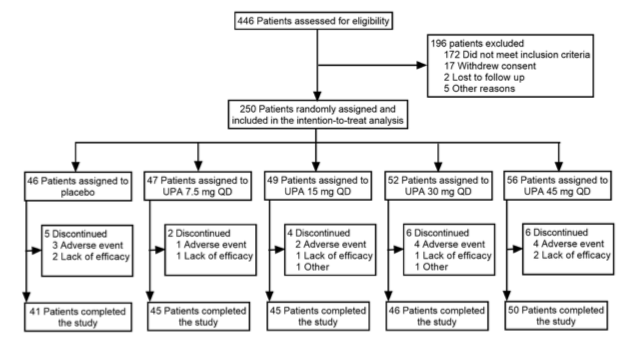

```{r setup, include=FALSE}
knitr::opts_chunk$set(echo = TRUE)
library(tidyverse)
library(glue)
library(janitor)
library(gt)
library(gtsummary)
library(ggtext)

# build status table
status <- tibble(randomized = c(rep("Yes", 250),
                 rep("No", 196)),
    excluded_reason = c(rep("None", 250), 
        rep("Did not meet inclusion criteria", 172), 
        rep("Withdrew consent", 17),
        rep("Lost to follow up", 2),
        rep("Other reasons", 5)),
    arm = c(rep("Placebo", 46),
            rep("Upa 7.5 mg QD", 47),
            rep("Upa 15 mg QD", 49),
            rep("Upa 30 mg QD", 52),
            rep("Upa 45 mg QD", 56),
            rep("None", 196)),
    completed = c(rep("Adverse Event", 3),
                  rep("Loss of Effect", 2),
                  rep("Completed", 41),
                  rep("Adverse Event", 1),
                  rep("Loss of Effect", 1),
                  rep("Completed", 45),
                  rep("Adverse Event", 2),
                  rep("Loss of Effect", 1),
                  rep("Other", 1),
                  rep("Completed", 45),
                  rep("Adverse Event", 4),
                  rep("Loss of Effect", 1),
                  rep("Other", 1),
                  rep("Completed", 46),
                  rep("Adverse Event", 4),
                  rep("Loss of Effect", 2),
                  rep("Completed", 50),
                  rep("None", 196)))
# now shuffle rows
set.seed(42)
rows <- sample(nrow(status))
status <- status[rows, ] 
# now add study_id, formatted as "000X"
study_id <- str_pad(1L:446L, width = 4,
                  side = "left", pad = "0")
status <- cbind(study_id, status)
status
```

## Why bother?
To begin, CONSORT diagrams are a common figure in the reporting of clinical trials. They are frequently used, but often require resorting to drawing flow diagrams in PowerPoint or Adobe Illustrator, removing the user from the R universe.<br>
<br>
There are a few solutions available on the web, but they either use diagrammeR, which is an elegant package designed to be adaptable to networks, which reformats the diagram with each addition or removal of a node or edge. This makes it less useful for a static flow diagram. Also, honestly, diagrammeR code is not very literate programming. It is quite difficult to interpret what is going on in the code for complex flowcharts with multiple nodes and edges.
<br>

A second possibility is using the grid package, opening viewports, and essentially hacking a flowchart by hand. This provides a lot of options and customizability, and there are a few examples that are quite effective, but hacky-looking and far from elegant.<br>
<br>
One of the great appeals of ggplot2 is that it is literate programming, which is concise, elegant, and consistent. In this document, I will try to reproduce a CONSORT diagram from a recent study on which I was a senior author using ggplot2.<br>
<br>


## Our goal
Out end goal is to reproduce this diagram from the phase 2 study of Upadacitinib in ulcerative colitis. It is a reasonably complex 5 arm dose-ranging study that should illustrate what we can do with ggplot2. The publication can be found [here](https://www.gastrojournal.org/article/S0016-5085(20)30241-9/pdf)



## Getting started 

Let’s first draw a 100 x 100 grid that will be our working space. The grid lines will help us align and place boxes exactly where we want them. Later on we will change the graph theme to theme_void() to remove the background when we don’t need it anymore.

```{r grid}
data <- tibble(x= 1:100, y= 1:100)
head(data)
```
<br>
Now let's add axes.
<br>

```{r axes}
data %>% 
  ggplot(aes(x, y)) +
  scale_x_continuous(minor_breaks = seq(10, 100, 10)) +
  scale_y_continuous(minor_breaks = seq(10, 100, 10)) +
  theme_linedraw() ->
  p
p
```

## Adding our first box and text
Now let’s add the top box with geom_rect, and the text with annotate. Feel free to fiddle with xmin, text location, until you have it right 
```{r first box, warning=FALSE}
p +
  geom_rect(xmin = 36, xmax=64, ymin=94, ymax=100, color='black',
            fill='white', size=0.25, size=0.25) +
  annotate('text', x= 50, y=97,label= '446 Patients assessed for eligibility', size=2.5) ->
  p

p
```

## Adding 2 more boxes
Now let’s add the top box with geom_rect, and the text with annotate. Feel free to fiddle with xmin, text location, until you have it right. Added 18 spaces after 196 patients excluded, to make it look sort of left-justified 

```{r}
p +
  geom_rect(xmin = 32, xmax=68, ymin=73, ymax=83, color='black',
            fill='white', size=0.25) +
  annotate('text', x= 50, y=78,label= '250 Patients randomly assigned\n and included in the intention-to-treat analysis', size=2.5) +
  geom_rect(xmin = 70, xmax=97, ymin=80, ymax=98, color='black',
            fill='white', size=0.25) +
  annotate('text', x= 83.5, y=89,label= '196 Patients excluded                 \n 172 Did not meet inclusion criteria\n 17 Withdrew consent\n 2 Lost to follow up\n 5 Other reasons', size=2.5) ->
  p
p
```

## Adding Arrows
Now let’s add the arrows between the top box and the bottom box, as well as the downward line and the exclusions box on the right. We will use geom_segment, which takes arguments x, xend, y, and yend to place the line segment, and we will add the size and arrow arguments to draw an arrow. Feel free to fiddle with xmin, text location, until you have it right 

```{r}
p +
  geom_segment(
    x=50, xend=50, y=94, yend=83.3, 
    size=0.15, linejoin = "mitre", lineend = "butt",
    arrow = arrow(length = unit(1, "mm"), type= "closed")) +
    geom_segment(
    x=50, xend=69.7, y=89, yend=89, 
    size=0.15, linejoin = "mitre", lineend = "butt",
    arrow = arrow(length = unit(1, "mm"), type= "closed")) ->
  p
p
```


## Now let’s add 5 arrows (and a horizontal line)!
Now let’s add the 5 arrows between the assignment box and randomization groups. The arrow in the middle will be longer than the others, as it goes all the way from the randomization box to the 3rd group assignment box. The other 4 arrows only go from a horizontal line to their assignment boxes.

We will start from the bottom of the randomization box (y=73), and the top of the assignment boxes at y=58.3.

Then we will add the horizontal line at y=65.

```{r five-arrows}
p +
  geom_segment(
  #middle arrow first
    x=50, xend=50, y=73, yend=58.3, 
    size=0.15, linejoin = "mitre", lineend = "butt",
    arrow = arrow(length = unit(1, "mm"), type= "closed")) +
  # then leftmost arrow, x and xend=10
  geom_segment(
    x=10, xend=10, y=65, yend=58.3, 
    size=0.15, linejoin = "mitre", lineend = "butt",
    arrow = arrow(length = unit(1, "mm"), type= "closed")) +
  # then 2nd arrow from the left, x and xend=30
  geom_segment(
    x=30, xend=30, y=65, yend=58.3, 
    size=0.15, linejoin = "mitre", lineend = "butt",
    arrow = arrow(length = unit(1, "mm"), type= "closed")) +
  # then 4th arrow from the left, x and xend=70
  geom_segment(
    x=70, xend=70, y=65, yend=58.3, 
    size=0.15, linejoin = "mitre", lineend = "butt",
    arrow = arrow(length = unit(1, "mm"), type= "closed")) +
# then rightmost arrow, x and xend=90
  geom_segment(
    x=90, xend=90, y=65, yend=58.3, 
    size=0.15, linejoin = "mitre", lineend = "butt",
    arrow = arrow(length = unit(1, "mm"), type= "closed")) +
  # then horizontal line, but remove the arrow
  geom_segment(
    x=10, xend=90, y=65, yend=65, 
    size=0.15, linejoin = "mitre", lineend = "butt")->
  p
p
```

## Now let’s add the assignment boxes!
Now let’s add the 5 assignment boxes below these 5 arrows. These will have y values from 49 to 58, and x values from 1-19, 21-39, 41-59, 61-79, and 81-99. Add the text as indicated in the figure

```{r assignment-boxes}
p +
  #first box on left
  geom_rect(xmin = 1, xmax=19, ymin=49, ymax=58, 
              color='black', fill='white', size=0.25) +
  annotate('text', x= 10, y=54, size=2.5,
             label= '46 Patients assigned\nto placebo') +
  #2nd box on left
  geom_rect(xmin = 21, xmax=39, ymin=49, ymax=58, 
              color='black', fill='white', size=0.25) +
  annotate('text', x= 30, y=54, size=2.5,
             label= '47 Patients assigned\nto UPA 7.5 mg QD') +
#3rd box on left
  geom_rect(xmin = 41, xmax=59, ymin=49, ymax=58, 
              color='black', fill='white', size=0.25) +
  annotate('text', x= 50, y=54, size=2.5,
             label= '49 Patients assigned\nto UPA 15 mg QD') +
#4th box on left
  geom_rect(xmin = 61, xmax=79, ymin=49, ymax=58, 
              color='black', fill='white', size=0.25) +
  annotate('text', x= 70, y=54, size=2.5,
             label= '52 Patients assigned\nto UPA 30 mg QD') +
#5th box on left
  geom_rect(xmin = 81, xmax=99, ymin=49, ymax=58, 
              color='black', fill='white', size=0.25) +
  annotate('text', x= 90, y=54, size=2.5,
             label= '56 Patients assigned\nto UPA 45 mg QD')->
  p
p
```

## Now let’s add the 5 long arrows!
Now let’s add the 5 long arrows below these 5 boxes These are off center, so they will have y values from 49 to 15.3, and x values of 2, 22, 42, 62, and 82. Add the text as indicated in the figure.

```{r five-long-arrows}
p +
  #first arrow on left
  geom_segment(
    x=2, xend=2, y=49, yend=15.3, 
    size=0.15, linejoin = "mitre", lineend = "butt",
    arrow = arrow(length = unit(1, "mm"), type= "closed")) +
  #2nd arrow on left
  geom_segment(
    x=22, xend=22, y=49, yend=15.3, 
    size=0.15, linejoin = "mitre", lineend = "butt",
    arrow = arrow(length = unit(1, "mm"), type= "closed")) +
#3rd arrow on left
  geom_segment(
    x=42, xend=42, y=49, yend=15.3, 
    size=0.15, linejoin = "mitre", lineend = "butt",
    arrow = arrow(length = unit(1, "mm"), type= "closed")) +
#4th arrow on left
  geom_segment(
    x=62, xend=62, y=49, yend=15.3, 
    size=0.15, linejoin = "mitre", lineend = "butt",
    arrow = arrow(length = unit(1, "mm"), type= "closed")) +
#5th arrow on left
  geom_segment(
    x=82, xend=82, y=49, yend=15.3, 
    size=0.15, linejoin = "mitre", lineend = "butt",
    arrow = arrow(length = unit(1, "mm"), type= "closed")) ->
  p
p
```

## Now let’s add the discontinuation boxes!
Now let’s add the 5 discontinuation boxes below these 5 boxes These are off center, so they will have y values from 40 to 25, and x values of 5-19, 25-39, 44-59, 65-79, and 85-99. Add the text as indicated in the figure. To make discontinued (sort of) left justified, add four spaces after each occurrence of discontinued.

```{r discontinuation}
p +
  #first box on left
  geom_rect(xmin = 5, xmax=19, ymin=25, ymax=40, 
              color='black', fill='white', size=0.25) +
  annotate('text', x= 12, y=33, size=2.5,
      label= '5 Discontinued    \n3 Adverse event\n2 Lack of efficacy') +
  #2nd box from left
  geom_rect(xmin = 25, xmax=39, ymin=25, ymax=40, 
              color='black', fill='white', size=0.25) +
  annotate('text', x= 32, y=33, size=2.5,
      label= '1 Discontinued    \n1 Adverse event\n1 Lack of efficacy') +
  #3rd box from left
  geom_rect(xmin = 45, xmax=59, ymin=25, ymax=40, 
              color='black', fill='white', size=0.25) +
  annotate('text', x= 52, y=33, size=2.5,
      label= '4 Discontinued    \n2 Adverse event\n1 Lack of efficacy\n1 Other') +
  #4th box from left
  geom_rect(xmin = 65, xmax=79, ymin=25, ymax=40, 
              color='black', fill='white', size=0.25) +
  annotate('text', x= 72, y=33, size=2.5,
      label= '6 Discontinued    \n4 Adverse event\n1 Lack of efficacy\n1 Other') +
#4th box from left
  geom_rect(xmin = 85, xmax=99, ymin=25, ymax=40, 
              color='black', fill='white', size=0.25) +
  annotate('text', x= 92, y=33, size=2.5,
      label= '6 Discontinued    \n4 Adverse event\n2 Lack of efficacy') ->p
p
```

## Now let’s add the short arrows!
Now let’s add the 5 short arrows to the discontinuation boxes. These will go from x=2 to x=4.7 (plus 20*N), at a y value of 32.5.

```{r short-arrows}
p +
#first arrow on left
  geom_segment(
    x=2, xend=4.7, y=32.5, yend=32.5, 
    size=0.15, linejoin = "mitre", lineend = "butt",
    arrow = arrow(length = unit(1, "mm"), type= "closed")) +
  #2nd arrow on left
  geom_segment(
    x=22, xend=24.7, y=32.5, yend=32.5, 
    size=0.15, linejoin = "mitre", lineend = "butt",
    arrow = arrow(length = unit(1, "mm"), type= "closed")) +
#3rd arrow on left
  geom_segment(
    x=42, xend=44.7, y=32.5, yend=32.5,  
    size=0.15, linejoin = "mitre", lineend = "butt",
    arrow = arrow(length = unit(1, "mm"), type= "closed")) +
#4th arrow on left
  geom_segment(
    x=62, xend=64.7, y=32.5, yend=32.5,  
    size=0.15, linejoin = "mitre", lineend = "butt",
    arrow = arrow(length = unit(1, "mm"), type= "closed")) +
#5th arrow on left
  geom_segment(
    x=82, xend=84.7, y=32.5, yend=32.5, 
    size=0.15, linejoin = "mitre", lineend = "butt",
    arrow = arrow(length = unit(1, "mm"), type= "closed")) -> p
p
```

## Now for the completion boxes!
Now let’s add the 5 completion boxes at the bottom. These will be aligned with the assignment boxes, so they will have y values from 15 to 7, and x values of 1-19, 21-39, 41-59, 61-79, and 81-99. Add the text as indicated in the figure.

```{r completion-boxes}
p +
  #first box on left
  geom_rect(xmin = 1, xmax=19, ymin=7, ymax=15, 
              color='black', fill='white', size=0.25) +
  annotate('text', x= 10, y=11, size=2.5,
             label= '41 Patients completed\nthe study') +
  #2nd box on left
  geom_rect(xmin = 21, xmax=39, ymin=7, ymax=15, 
              color='black', fill='white', size=0.25) +
  annotate('text', x= 30, y=11, size=2.5,
             label= '45 Patients completed\nthe study') +
#3rd box on left
  geom_rect(xmin = 41, xmax=59, ymin=7, ymax=15, 
              color='black', fill='white', size=0.25) +
  annotate('text', x= 50, y=11, size=2.5,
             label= '45 Patients completed\nthe study') +
#4th box on left
  geom_rect(xmin = 61, xmax=79, ymin=7, ymax=15,  
              color='black', fill='white', size=0.25) +
  annotate('text', x= 70, y=11, size=2.5,
             label= '46 Patients completed\nthe study') +
#5th box on left
  geom_rect(xmin = 81, xmax=99, ymin=7, ymax=15,  
              color='black', fill='white', size=0.25) +
  annotate('text', x= 90, y=11, size=2.5,
             label= '50 Patients completed\nthe study')->
  p
p
```

## Now for the big reveal!
Let’s take away the axes and gridlines to reveal our creation!

```{r}
p + theme_void()
```

## Once more, Programmatically
Let's try this again, but with a programmatic approach.

We will start by taking a look at the status table from this clinical trial. The status table has 5 variables:

- study_id
- randomized
- excluded_reason
- arm
- completed

Take a look at the status table data for the 446 screeened patients. Then we will look at tabyls for each of the four categorical variables
```{r status}
head(status)
status %>% tabyl(randomized)
status %>% tabyl(excluded_reason)
status %>% tabyl(arm)
status %>% tabyl(completed)
```
Now let's see if we can rebuild the consort diagram programmatically. We will build up each piece.
But we will not use any of the raw numbers.
Instead, this time we will extract each one from the status table.

```{r axes2}
data %>% 
  ggplot(aes(x, y)) +
  scale_x_continuous(minor_breaks = seq(10, 100, 10)) +
  scale_y_continuous(minor_breaks = seq(10, 100, 10)) +
  theme_linedraw() ->
  p2
p2
```
<br>
The top box is the number of patients assessed for eligibility. 

```{r assessed}
top_box <- glue(status %>% tally() %>% pull(), " Patients Assessed for Eligibility")

# Note - ideally we would calculate xmin and xmax based on the length of top_box
# const = top_box %>% str_length() * 0.38
# xmin = 50 - const
# xmax = 50 + const

p2 + geom_rect(xmin = 36, xmax=64, ymin=94, ymax=100, color='black', fill='white', size=0.25, size=0.25) +
  annotate('text', x= 50, y=97,label= top_box, size=2.5) ->
  p2
# note that this actually looks fine when you zoom, not so much in the preview below.
p2
```
### Now let's try to build the patients excluded table

```{r}
status %>% 
  filter(randomized == "No") %>% 
  tabyl(excluded_reason) %>% 
  adorn_totals("row") %>% 
  select(n, excluded_reason) %>% 
  arrange(desc(n)) ->
exclusion_table

exclusion_table[1,2] <- "Patients excluded"

mutate(exclusion_table,
  col_new = paste(n, excluded_reason)) %>% 
  select(col_new) 
```

### Now let's build the text for the assignment box
```{r assigned}
status %>% 
  filter(randomized == "Yes") %>% 
  tally() %>% 
  pull() ->
num_assigned

assign_box <- glue(num_assigned, " Patients randomly assigned\nand included in the intention-to-treat analysis")
```

### Now let's build the text for boxes for assignment to each arm
```{r assignment2, warning=FALSE}
# note that ordering is tricky, often may want to customize
# this version arranges by ascending dose
# considering Placebo as dose = 0

# build a vector of arms, arranged in order
# might need this later
status %>% 
  distinct(arm) %>% 
  filter(arm != "None") %>% 
  mutate(num = parse_number(arm)) %>% 
  replace_na(list(num = 0)) %>% 
  arrange(num) %>% 
  pull(arm) ->
arms_vec

# tally n for assignment boxes by arm, ordered
status %>% 
  filter(arm != "None") %>% 
  count(arm) %>% 
  mutate(num = parse_number(arm)) %>% # extract dose
  replace_na(list(num = 0)) %>% # make placebo dose 0
  arrange(num) %>% #ordering by dose
  mutate(col_new = paste(n, "Patients assigned\nto ", arm)) %>% 
  select(col_new) 
```


### Now let's try to build the text for boxes for reasons discontinued by arm

```{r}
status %>% 
  filter(randomized == "Yes") %>% 
  filter(completed != "Completed") %>% 
  select(study_id, arm, completed) %>% 
  arrange(arm, completed) ->
discontinued_table
discontinued_table

# build a function, run across arms with purrr
# example for one group
discontinued_table %>% 
  filter(arm == "Placebo") %>% 
  tabyl(completed) %>% 
  adorn_totals("row") %>% 
  arrange(desc(n)) ->
discontinued_group
discontinued_group[1,1] <- "Discontinued"

mutate(discontinued_group, col_new = paste(n, completed))%>%
  select(col_new) 
```
### Now let's build the text for the completion boxes for each arm
```{r completed2, warning=FALSE}
# note that ordering is tricky, often may want to customize
# this version arranges by ascending dose
# considering Placebo as dose = 0

# build a vector of arms, arranged in order
# might need this later
status %>% 
  distinct(arm) %>% 
  filter(arm != "None") %>% 
  mutate(num = parse_number(arm)) %>% 
  replace_na(list(num = 0)) %>% 
  arrange(num) %>% 
  pull(arm) ->
arms_vec

# tally n for completion boxes by arm, ordered
status %>% 
  filter(completed == "Completed") %>% 
  count(arm) %>% 
  mutate(num = parse_number(arm)) %>% # extract dose
  replace_na(list(num = 0)) %>% # make placebo dose 0
  arrange(num) %>% #ordering by dose
  mutate(col_new = paste(n, "Patients completed\nthe study")) %>% 
  select(col_new) %>% 
  pull()
```
### now lets' try to do the top 3rd programmatically
with 3 chunks of text, 3 boxes, 3 lines.    
Build the box_lines_top dataframe
```{r}
boxes <- c("assessment_box", "exclusion_box", "randomization_box")
box_num <- c(1:3)
lines <- c(1:3)
line_arrow <- c(1,1,0) # whether or not to have arrowhead
top_tbl <- tibble(boxes, box_num, lines, line_arrow)

# build text for exclusion table
status %>% 
  filter(randomized == "No") %>% 
  tabyl(excluded_reason) %>% 
  adorn_totals("row") %>% 
  select(n, excluded_reason) %>% 
  arrange(desc(n)) ->
exclusion_table

exclusion_table[1,2] <- "Patients excluded"

exclusion_table2 <- mutate(exclusion_table,
  col_new = paste0(n, " ",excluded_reason, "\n")) %>% 
  select(col_new) 
# measure max_length of string in col_new
exclusion_table2$char_wide <- max(nchar(exclusion_table2$col_new)) - 2
# will later put this width into top_tbl row 2

# glue into single string with line breaks
label_ex <- glue_collapse(exclusion_table2$col_new) %>% #collapses to single string
  str_trim() #removes the last \n
# put into top_tbl$label[2]

# create labels for boxes 1-3
top_tbl$label[1] <- glue(status %>% tally() %>% pull(), " Patients Assessed for Eligibility")
top_tbl$label[2] <- label_ex # created above
top_tbl$label[3] <- glue(status %>% filter(randomized == "Yes") %>% tally() %>% pull(), " Patients randomly assigned\nand included in the intention-to-treat analysis")

top_tbl$lines <- str_count(top_tbl$label, "\n") +1

top_tbl$char_wide[1] <- str_split(top_tbl$label[1], "\n") %>% unlist() %>% str_length() %>% max()
top_tbl$char_wide[2] <- exclusion_table2$char_wide[1]
top_tbl$char_wide[3] <- str_split(top_tbl$label[3], "\n") %>% unlist() %>% str_length() %>% max()
```

### calculate top box width, height, location
```{r}
top_tbl <- top_tbl %>% 
  mutate(box_height = lines *0.56,
         box_width = char_wide*0.2,
         x = 50,
         box_center = c(95,85, 70),
         y = box_center - box_height)

top_tbl$x[2] <- 86
```

```{r}
# try with geom_rect
h_const = 5 # set adjustment for box height by # of lines
w_const = 0.33 # set adjustment for box width by # of characters
top_tbl %>% 
  mutate(xmin = 50 - char_wide * w_const,
         xmax = 50 + char_wide * w_const,
         ymin = 100 - lines * h_const,
         ymax = 100) ->
top_tbl2

top_tbl2$xmin[2] <- (85 - top_tbl2$char_wide[2] * w_const)
top_tbl2$xmax[2] <- (85 + top_tbl2$char_wide[2] * w_const)
top_tbl2$ymin[2] <- (top_tbl2$ymin[1] - 5 - top_tbl2$lines[2]*h_const)
top_tbl2$ymax[2] <- (top_tbl2$ymin[1] -5)

top_tbl2$ymin[3] <- (top_tbl2$ymin[2] - 5 - top_tbl2$lines[3]*h_const)
top_tbl2$ymax[3] <- (top_tbl2$ymin[2] -5)

ggplot(top_tbl2) +
      geom_rect(aes(xmin=xmin, xmax = xmax, ymin = ymin, ymax = ymax),
                fill = "white", color = "black") +
  annotate('text', x= 50, y= top_tbl2$ymax[1]- (top_tbl2$ymax[1]- top_tbl2$ymin[1])/2,
           label= top_tbl2$label[1], size=2.5) +
  xlim(0,100) + ylim(0,100)
```

```{r geom_label attempt at boxes}
data <- tibble(x= 1:100, y= 1:100)
data %>% 
  ggplot(aes(x, y)) +
  scale_x_continuous(minor_breaks = seq(10, 100, 10)) +
  scale_y_continuous(minor_breaks = seq(10, 100, 10)) +
  theme_linedraw() ->
  p
# geom label attempt - hard to know where edges are.
p +
  geom_label(data = top_tbl,
            mapping = aes(x= x, y=y, label=label), 
            label.size=0.25, size = 3, label.r = unit(0.0, "lines")) +
      xlim(0, 100) + ylim(0, 100) ->
  q

# generate line 1
top_tbl$x[1] = 50
top_tbl$y[1] = 95-2
top_tbl$xend[1] = 50
top_tbl$yend[1] = 71.5
top_tbl$x[2] = 50
top_tbl$y[2] = 82.2
top_tbl$xend[2] = 86-top_tbl$box_width/1.7
top_tbl$yend[2] = 82.2
top_tbl$x[3] = 50
top_tbl$y[3] = 66.5
top_tbl$xend[3] = 50
top_tbl$yend[3] = 62

q +   geom_segment(data = top_tbl, aes(x=x, y=y, xend=xend, yend=yend),
               lineend = "round", linejoin = "round",
               arrow = arrow(length = unit(0.2, "cm"),
                             ends = "last", type = "closed"), arrow.fill = "black")
ggplot(top_tbl[3,]) +
  aes(x, y, label = label) +
    geom_textbox(hjust = 0.5, vjust = 0.5,
                 halign = 0.5, valign = 0.5,
                 box.r=unit(0, "pt"),
                 width = unit(0.85, "native")) +
    xlim(0, 100) + ylim(0, 100)

```

## TODO List
### Build gtsummary with spanner for patients excluded
### place on plot
### build randomized box
### place on plot
### build assignment text boxes by arm
### place on plot
### Build gtsummary with spanner for discontinued by arm
### place on plot
### Build boxes for discontinued by arm
### Place on plot
### add first 2 arrows
### add horizontal line and 5 arrows
### add 5 long arrows
### add 5 short arrows
### add theme_void
