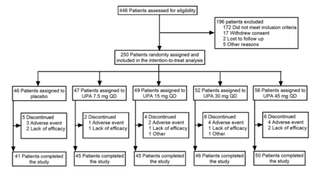
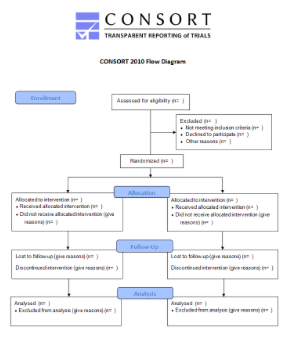
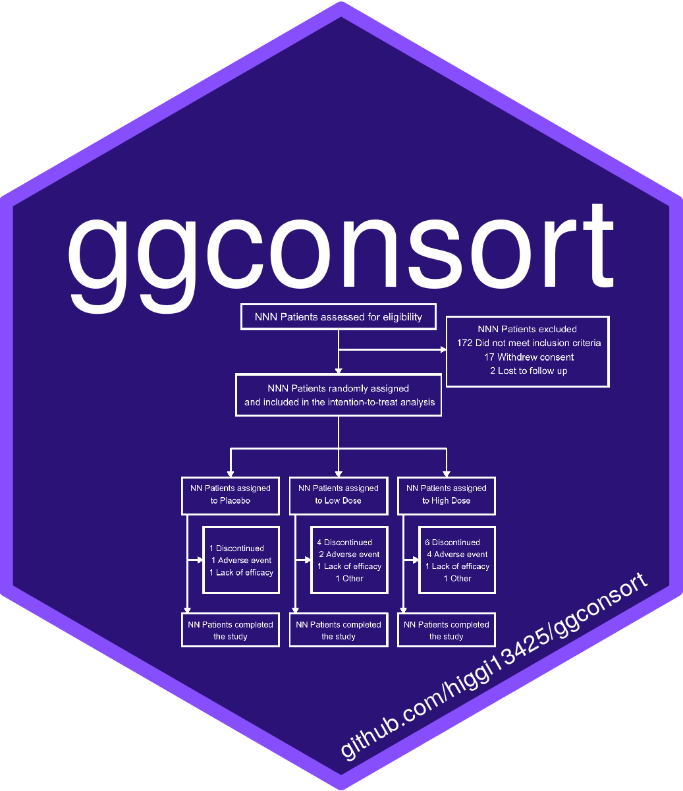

```{r setup, include=FALSE}
options(htmltools.dir.version = FALSE)
library(xaringan)
library(tidyverse)
```


class: top, left

# CONSORT diagrams

### To promote transparency

In clinical trials, a CONSORT diagram shows the flow of participants from screening to analysis, while identifying and providing reasons for dropout or exclusion of participants at each step along the way.


---

class: top, left

# CONSORT diagrams

### Endorsed by most medical journals

CONSORT = Consolidated Standards of Reporting Trials, developed by the CONSORT group, <http://www.consort-statement.org>, which started in 1993 to improve the quality of reporting of clinical trials.


---

class: top, left

# An Artisanal Product

- CONSORT diagrams are now commonly used, but the template provided does not provide an underlying data structure, or best practices for building a diagram. 
- The CONSORT diagram has become an artisanal product, built by counting categories and copy/pasting results into templates. 
- This leads to frequent errors in which the participant numbers don't add up. 
- Most CONSORT diagrams are built from templates in MS Word, Powerpoint, or Adobe Illustrator.


---


class: middle, center
# Knit or Infinite Moon Reader Addin


---


class: center, bottom
# You only live once!


---


class: left, bottom
# Hello Ninja


---


# R Code

```{r comment='#'}
# a boring regression
fit = lm(dist ~ 1 + speed, data = cars)
coef(summary(fit))

```

---

# R Plots

```{r cars, fig.height=4, dev='svg'}
par(mar = c(4, 4, 1, .1))
plot(cars, pch = 19, col = 'darkgray', las = 1)
abline(fit, lwd = 2)
```

---

# Tables

If you want to generate a table, make sure it is in the HTML format (instead of Markdown or other formats), e.g.,

```{r}
knitr::kable(head(iris), format = 'html')
```


---
class:top, left
# The Package

---
class:top, left
# The Repository

---
class:top, left
# The Hex Sticker

Because one must always have a hex sticker


```{r, echo=FALSE, out.width="55%", fig.cap="A nice image."}

```

