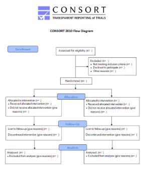

```{r setup, include=FALSE}
options(htmltools.dir.version = FALSE)
library(xaringan)
library(xaringanthemer)
library(tidyverse)
```

```{r xaringan-themer, include=FALSE, warning=FALSE}
library(xaringanthemer)
style_duo_accent(
  primary_color = "#292077" ,
  secondary_color = "#8c54fc",
  inverse_header_color = "#FFFFFF"
)
```
class: header_background, center
# {ggconsort}


```{r, echo=FALSE, out.width="57%"}
knitr::include_graphics("hex-ggconsort.png")
```

---

class: header_background

# CONSORT diagrams

### To promote transparency

In clinical trials, a CONSORT diagram shows the flow of participants from screening to analysis, while identifying and providing reasons for dropout or exclusion of participants at each step along the way.


---

class: header_background

# CONSORT diagrams

### Endorsed by most medical journals
.pull-left[
CONSORT = Consolidated Standards of Reporting Trials, developed by the CONSORT group, <http://www.consort-statement.org>, which started in 1993 to improve the quality of reporting of clinical trials.
]
.pull-right[

]
---

class: header_background

# An Artisanal Product

- CONSORT diagrams are now commonly used to report RCTs,<br>
  but the template provided does not provide: 
  + An underlying data structure, or 
  + Best practices for building a diagram. 
- The CONSORT diagram has become an artisanal product
  + Usually built by counting categories and 
  + Copy/pasting results into templates. 
- This leads to frequent errors in which the participant numbers don't add up. 
- Most CONSORT diagrams are built from templates in 
  + MS Word
  + Powerpoint, or 
  + Adobe Illustrator.

---

class: header_background

# Naming Diagram Components
### insert marked up image here
- note top has N = 1 of each
- note bottom has N = n_arms of each
---

class: header_background

# {ggconsort} Basic Functionality

## draw_consort(status_table)

- any # of arms from 2 to 8 (or more)
- auto-wraps text in boxes with _str_wrap()_
- can control text wrap with `\n`
- fits boxes to height, width of text
- creates lines and arrows to box center edges
- sets standard vertical and horizontal spacing between boxes, lines
- creates plot area sufficient to contain diagram
- then draws the diagram


---

class: header_background
# Under the Hood

- Requires a standardized status_table as input
- Counts the number of participants in each box/arm
- Creates text for each box in a box_table
- Calculates height, width, center of boxes in box_table
- Calculates position of each box in box_table
- Calculates start, end of each line (one without arrowhead)
- {ggplot2} draws the elements in box_table

---

class: header_background

# Demo for 2 arms

---

class: header_background
# Demo for 8 arms

---

class: header_background
# Requirements of a Status Table
- One row per candidate participant
- Includes both: 
  + randomized participants
  + and candidate participants excluded (aka screen failures)
  
- (optional) column - studyid
- column `randomized` -             Yes or NA
- column `exc_reason` -             Text or NA
- column `arm` -                    Text per Arm or NA
- column `recieved_med` -           Yes or NA
- column `dnr_reason` -             Text or NA
- column `completed` -              Yes or NA
- column `discontinued_reason` -    Text or NA
- column `analyzed` -               Yes or NA
- column `not_an_reason` -          Text or NA

---

class: header_background
# Example of a Status Table
```{r, echo=FALSE, out.width="100%", fig.align='center'}

```

---
class: header_background
# The Package and Repository
.center[
https://github.com/higgi13425/ggconsort
]

```{r, echo=FALSE, out.width="80%", fig.align='center'}
knitr::include_graphics("github-ggconsort.png")
```
---
class: header_background
# The Hex Sticker

```{r, echo=FALSE, out.width="53%", fig.cap="Because one must always have a hex sticker", fig.align='center'}
knitr::include_graphics("hex-ggconsort.png")
```


---
class: header_background
# Collaborators Wanted!
## Goals
- A better README
- More (and better) vignettes
- An improved {pkgdown} site
- Helper functions to take standard data formats and make a status_table from:
  + CDISC data format
  + tidycdisc data format?
  + ADaM data format
- More options, customization - currently like the original Model T.
  + You can have any font or spacing that you want, as long as it is the default.

---
class: inverse, center, middle

# Thanks!


